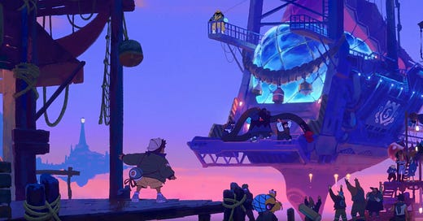
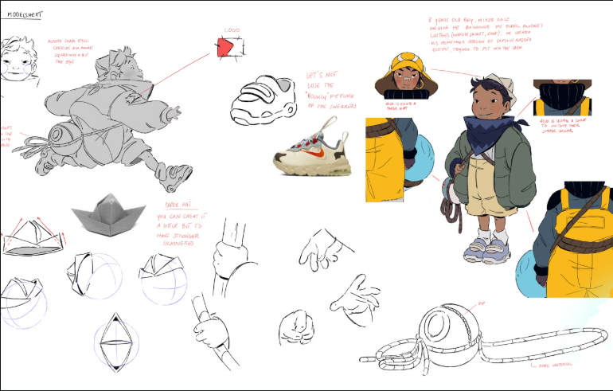
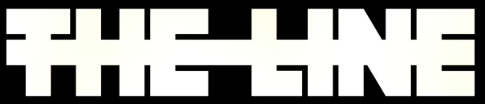
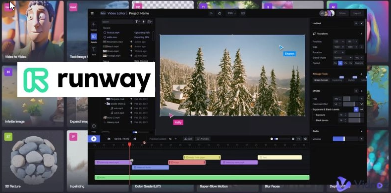
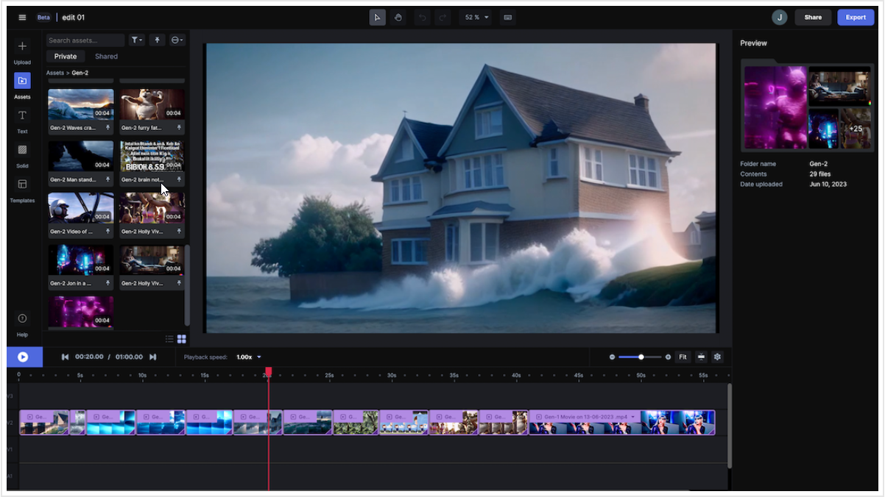

# PAC3 – Manovich Reloaded  
**Autor:** Kevin Gaspar Rubio  
**Assignatura:** Cultura Digital - Aula 1 – UOC  
**Títol:** Hibridacions audiovisuals emergents: més enllà del programari tradicional  

## Introducció

En aquest assaig es presenten dos casos recents d'hibridació audiovisual que exemplifiquen com el programari, l'animació i la intel·ligència artificial poden fusionar disciplines i mitjans per generar nous formats creatius. Partint del concepte d’hibridació exposat per Lev Manovich a *El software toma el mando*, analitzarem com aquestes noves pràctiques no només barregen mitjans visuals, sinó també processos productius i lògiques narratives que transformen la creació digital contemporània.

---

## Exemple 1: *Delivery at Dawn* – The Line Animation

### Descripció del projecte

*Delivery at Dawn* és un curtmetratge d'animació creat per l'estudi britànic The Line, conegut per la seva capacitat de trencar les fronteres entre tècniques d'animació tradicionals i digitals. El curt narra el viatge d’un missatger en una ciutat futurista, amb un estil visual proper a l’anime i un tractament tècnic altament híbrid que el converteix en un exemple excel·lent de fusió de llenguatges.

A nivell formal, la peça destaca per la seva combinació d’animació 2D dibuixada a mà amb entorns i càmeres 3D, renderitzats amb motors gràfics propis del videojoc. Els personatges mantenen el traç orgànic i expressiu de l’animació clàssica, mentre que els espais per on es mouen estan construïts digitalment, permetent moviments de càmera més complexos, variacions de llum en temps real i una sensació de profunditat escènica que la 2D pura no pot oferir.

Aquest sistema híbrid fa possible coreografies dinàmiques, i una posada en escena que combina la immediatesa del videojoc amb la intensitat emocional del cinema.

A més, el projecte s’ha beneficiat de processos automatitzats mitjançant intel·ligència artificial, com la interpolació de frames o l’ajust de moviment facial, optimitzant la producció sense perdre control artístic.

Aquest ús de la IA no substitueix l’artista, sinó que amplifica la seva capacitat d’intervenció, eliminant tasques repetitives i permetent enfocaments més creatius.

  

### Anàlisi amb les “ulleres de Manovich”

Amb les "ulleres de Manovich", podem llegir *Delivery at Dawn* com un producte resultant del que ell anomena *metamedium*: un entorn on múltiples mitjans (animació, videojoc, cinema, codi) coexisteixen i es retroalimenten a través del programari. Aquí, el programari no és només una eina de producció, sinó l’escenari mateix de la creació.

L’obra no es limita a simular formats antics, sinó que crea un nou llenguatge visual nascut de la fusió, en línia amb el que Manovich anomena *deep remixability*: la capacitat del programari per combinar capes funcionals de diferents mitjans a nivell estructural. Aquesta profunditat de la hibridació no només afecta l'estètica, sinó també el flux de treball, la semàntica narrativa i l’autoria digital.

També exemplifica com el programari redefineix la relació entre l’humà i la màquina: l’artista no només utilitza eines, sinó que crea dins un entorn que genera possibilitats expressives pròpies.

  

### Conclusions

*Delivery at Dawn* no només és una peça visualment atractiva, sinó un reflex clar del nou paradigma de creació audiovisual que Manovich anticipava. És un producte que només pot existir gràcies a la hibridació entre disciplines i tecnologies. La combinació d’animació manual, entorns virtuals, engines de videojoc i processos automatitzats exemplifica una nova era on els límits entre art, tècnica i programari són cada cop més difusos.

🔗 [Behind the scenes a Instagram](https://www.instagram.com/thelineanimation/)  
🔗 [The Line – Web oficial](https://thelinestudio.com)
🔗 [The Line – Web oficial- Delivery at dawn](https://thelinestudio.com/work/delivery-at-dawn)
🔗 [Youtube – Vídeo](https://www.youtube.com/watch?v=hm8XpXh-ayo)

  

---

## Exemple 2: *Runway Gen-2* – Intel·ligència artificial i vídeo generatiu

### Descripció del projecte

*Runway Gen-2* és una de les eines més innovadores dins del camp de la creació audiovisual basada en intel·ligència artificial. Desenvolupada per l’empresa Runway, aquesta plataforma representa una nova hibridació radical entre llenguatge escrit, algoritmes d’aprenentatge automàtic i vídeo generatiu.

Permet, a partir d’un simple text, generar clips de vídeo breus, realistes i amb una estètica cinematogràfica sorprenent. L’usuari només ha d’introduir un *prompt*, com ara “una ciutat abandonada coberta per boira”, i l’eina genera un clip coherent, amb moviment, il·luminació i color.

Aquest procés és possible gràcies a models d’aprenentatge profund entrenats amb grans bases de dades audiovisuals. El sistema entén el llenguatge natural, el transforma en vectors semàntics i els converteix en imatges en moviment mitjançant tècniques com els GANs (Generative Adversarial Networks) i els models de difusió. Tot això sense necessitat de rodatge, animació manual ni muntatge.

És un entorn de creació radicalment diferent on el llenguatge verbal assumeix funcions pròpies de la càmera, l’actor i el director.

  

### Anàlisi amb les “ulleres de Manovich”

Manovich descriu el programari com un sistema que genera nous llenguatges visuals, i això és precisament el que fa *Runway*: crea un mitjà nou. Aquí, el llenguatge escrit no només serveix per descriure, sinó que es converteix en l’eina central de creació visual.

És una hibridació total entre expressió verbal, algoritmes computacionals i narrativa audiovisual, que transforma l’autoria tal com l’entenem. Seguint la idea de Manovich del programari com a *capa cultural*, *Runway* no només opera com una eina funcional, sinó com un entorn creatiu capaç de generar codis visuals propis, reformulant l'espai entre llenguatge i imatge, entre decisió humana i generació algorítmica.

A més, *Runway* no només genera vídeo, sinó que permet combinar diversos inputs (text, imatges, vídeo de referència), crear transicions, aplicar filtres i ajustar estils visuals, fent que la IA actuï com una mena de "coautor creatiu", en coherència amb la visió de Manovich sobre el paper actiu del programari en la producció cultural contemporània.

  

### Conclusions

*Runway Gen-2* representa un cas extrem d’hibridació, tant en la seva forma com en la seva metodologia. Transforma completament la lògica clàssica de producció audiovisual i obre un debat sobre el futur de l’autoria, la creativitat i la figura de l’artista.

És un exemple perfecte d’on pot portar la fusió entre narrativa, algoritmes i estètica visual en el context d’un programari que ja no només ajuda a crear, sinó que crea per si sol.

🔗 [Runway Gen-2 – Web oficial](https://runwayml.com)  
🔗 [Tutorial - Youtube](https://www.youtube.com/watch?v=CXOKxia5X8w)
🔗 [Vídeo de mostra - Youtube](https://www.youtube.com/watch?v=yYMpI3208ts)

  

---

## Conclusions generals

Els dos casos analitzats, *Delivery at Dawn* i *Runway Gen-2*, mostren com l’hibridació audiovisual contemporània va molt més enllà de la simple barreja de tècniques o estils visuals. Estem davant d’un canvi de paradigma on el programari es converteix en l’eix central de la creació, no només com a eina sinó com a llenguatge i entorn conceptual.

Amb les “ulleres de Manovich”, podem entendre aquestes pràctiques com a part d’un procés de transformació més profund: la dissolució dels límits entre disciplines, la reconfiguració del rol de l’artista i la irrupció de nous formats narratius i visuals que només poden existir dins lògiques de programari.

Aquestes hibridacions exemplifiquen una nova estètica de la creació digital, on la col·laboració entre humans i màquines ja no és una excepció, sinó una norma emergent. I en aquest nou escenari, el pensament crític, la capacitat d’adaptació i la comprensió dels mitjans híbrids seran claus per interpretar i crear el món visual que ve.

---

## Referències

- Manovich, L. (2013). *El software toma el mando*. Editorial UOC.  
- [The Line Animation](https://thelinestudio.com)  
- [Runway ML](https://runwayml.com)  
- [Instagram – The Line](https://www.instagram.com/thelineanimation/)

---

## Ús d'intel·ligència artificial

Per a la revisió sintàctica i estilística del text, s'ha fet ús puntual de **ChatGPT** (OpenAI, 2024), respectant els criteris d'autoria i reflexió pròpia establerts per la UOC.

